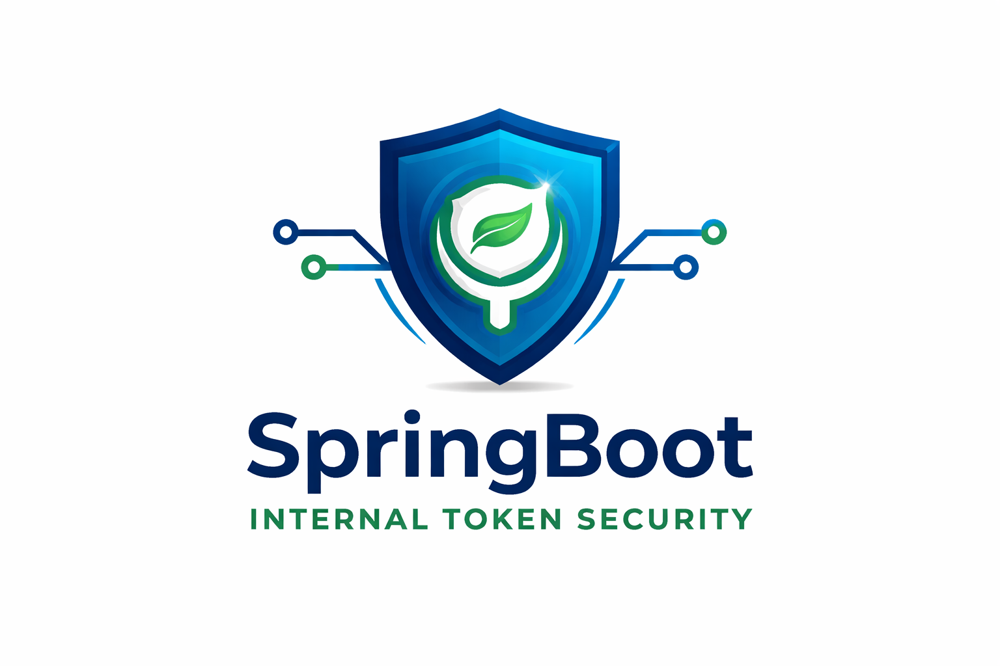

# SpringBoot Internal Token Security



Security platform for microservice architectures using internal JWT token exchange. After external authentication, the gateway issues a signed internal token that is automatically propagated between services through security filters and HTTP interceptors, ensuring authentication, multi-tenant isolation, and secure service-to-service communication.

---

# Architecture

The platform follows a gateway-based security model.

1. External clients authenticate against the gateway.
2. The gateway validates the external token.
3. A short-lived internal JWT token is generated and signed using an RSA private key.
4. The token is forwarded to downstream microservices.
5. Each service verifies the signature using the public key and establishes the security context.

This approach ensures that:

* services do not need to trust external tokens directly
* service-to-service communication remains secure
* authentication information is propagated automatically

---

# Internal Token Flow

Client Request
→ Gateway authentication
→ Internal JWT generation
→ Token propagation through HTTP headers
→ Service validation and security context creation

The internal token contains:

* user identifier
* tenant identifier
* user roles
* token version
* expiration time

---

# Project Structure

```
SpringBoot-Internal-Token-Security
│
├── common-security
│   ├── auth
│   │   ├── InternalAuthentication
│   │   ├── InternalPrincipal
│   │   └── InternalTokenFilter
│   │
│   ├── config
│   │   ├── PublicKeyProvider
│   │   └── SecurityConfiguration
│   │
│   ├── http
│   │   ├── InternalTokenInterceptor
│   │   └── InternalRestTemplateConfig
│   │
│   ├── metrics
│   │   └── AuthMetrics
│   │
│   └── tenant
│       ├── TenantContext
│       └── ReactiveTenantContext
│
├── gateway
│   ├── filter
│   │   └── InternalAuthGatewayFilter
│   │
│   ├── token
│   │   └── InternalTokenGenerator
│   │
│   └── config
│       └── PrivateKeyProvider
│
├── orders-service
│   ├── controller
│   │   └── OrdersController
│   └── config
│       └── SecurityConfig
│
└── kubernetes
    ├── network-policy.yaml
    └── key-generation.sh
```

---

# Key Components

Gateway
Responsible for validating external authentication and generating signed internal tokens.

Common Security Module
Reusable security layer shared by all services. Provides token validation, authentication context, tenant isolation, and token propagation.

Internal Token Filter
Validates JWT tokens and populates the Spring Security context.

Token Interceptor
Automatically propagates internal tokens between services when using RestTemplate.

Tenant Context
Provides tenant isolation using thread-local or reactive context.

Metrics
Authentication metrics exposed via Micrometer.

---

# Security Design

The system uses asymmetric cryptography.

Gateway
Signs tokens using a private RSA key.

Services
Verify tokens using the public key.

This prevents services from generating tokens themselves and ensures centralized trust.

Token characteristics:

* RS256 signature
* short lifetime (5 minutes)
* versioned tokens
* role-based authorities
* tenant isolation

---

# Deployment

The platform is designed to run in Kubernetes.

The private key is stored as a Kubernetes Secret and mounted in the gateway.

The public key is stored as a ConfigMap and shared with services.

Network policies restrict service access so that only the gateway can call internal services.

---

# Key Generation

Keys can be generated using OpenSSL.

```
openssl genpkey -algorithm RSA -out private.pem
openssl rsa -in private.pem -pubout -out public.pem
```

---

# Technologies

* Spring Boot
* Spring Security
* JSON Web Tokens
* Micrometer
* Kubernetes
* RSA cryptography

---

# License

This project is licensed under the MIT License.

Permission is hereby granted, free of charge, to any person obtaining a copy
of this software and associated documentation files (the "Software"), to deal
in the Software without restriction, including without limitation the rights
to use, copy, modify, merge, publish, distribute, sublicense, and/or sell
copies of the Software, subject to the following conditions:

The above copyright notice and this permission notice shall be included in all
copies or substantial portions of the Software.

THE SOFTWARE IS PROVIDED "AS IS", WITHOUT WARRANTY OF ANY KIND.

